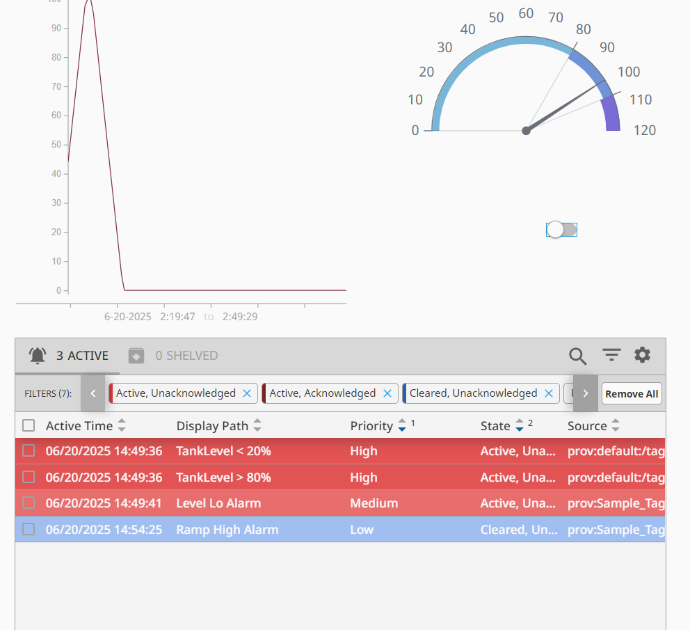
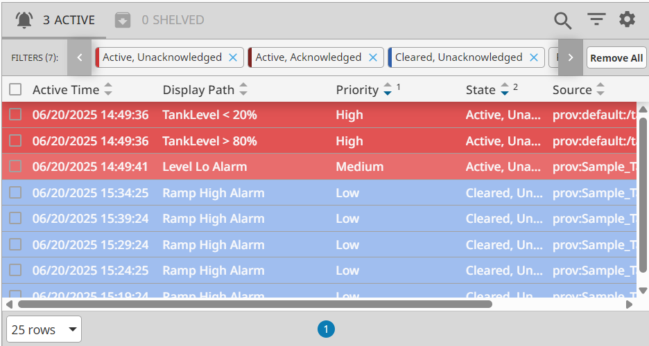
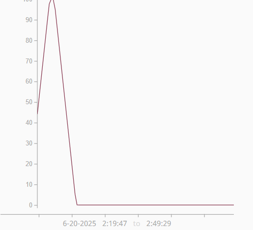
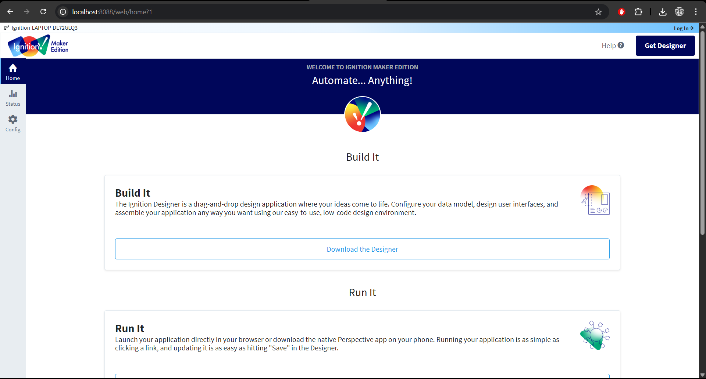

# 🛢️ Ignition SCADA Tank Monitoring System

This is a semi-advanced SCADA demo project built using **Inductive Automation’s Ignition Maker Edition**, designed to simulate a smart tank level monitoring system like those used in oil, water, and industrial pipeline control systems.

---

## 💡 Features

- **Simulated Tags** for:
  - `TankLevel` (Integer: 0–100%)
  - `PumpStatus` (Boolean)
  - `HighAlarm` & `LowAlarm` (Boolean logic)
- **Dynamic HMI Interface** built using Ignition Perspective
  - Tank level gauge
  - Toggle switch to control pump
  - Alarm status table with acknowledgement
  - Trend chart showing historical tank level
- **Scripted Logic**
  - Gateway Timer Script to auto-increase/decrease `TankLevel` based on `PumpStatus`
- **Alarm Configuration**
  - High alarm triggered when `TankLevel > 80`
  - Low alarm triggered when `TankLevel < 20`
- **Tag Historian**
  - Tracks and plots `TankLevel` over time

---

## 📸 Screenshots

| UI Element         | Preview |
|--------------------|---------|
| HMI Interface      |  |
| Active Alarm       |  |
| Trend Graph        |  |
| Gateway Homepage   |  |
| Toggle Interaction |  |

---

## 🛠️ Tools Used

- **Ignition Designer (Maker Edition)**
- **Perspective Module (for HMI)**
- **Tag Historian**
- **Gateway Scripting**
- **Memory Tags and Alarming Module**

---

## 📂 Folder Structure

```
ignition-scada-tank-monitoring/
├── README.md
├── screenshots/                  ← UI and alarm demo
└── project/                      ← Exported Ignition Project ZIP

```

---

## 🧠 Author Notes

This project was built as part of a SCADA training program to demonstrate core industrial automation concepts.

> ✅ Open to feedback and collaboration!
